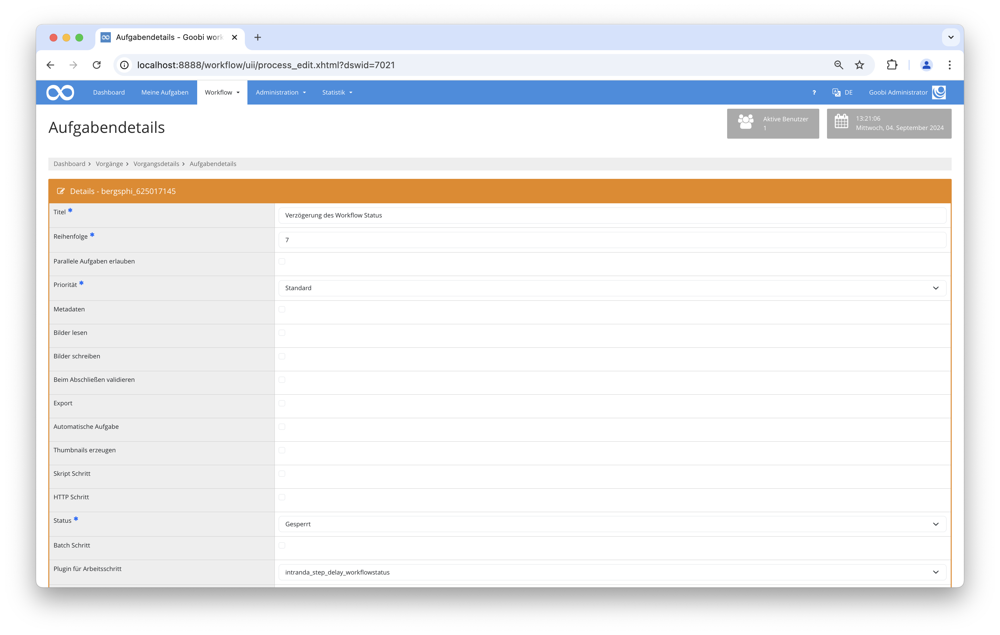

## Einführung
Die vorliegende Dokumentation beschreibt die Installation, Konfiguration und den Einsatz des Plugins. Mit Hilfe dieses Plugins kann geprüft werden, ob ein Workflow einen bestimmten Status erreicht hat. Nur wenn dies der Fall ist, wird ein definierter Arbeitschritt geschlossen und der nächste Schritt geöffnet.

## Installation
Um das Plugin nutzen zu können, müssen folgende Dateien installiert werden:

```bash
/opt/digiverso/goobi/plugins/step/plugin_intranda_step_delay_workflowstatus.jar
/opt/digiverso/goobi/config/plugin_intranda_step_delay_workflowstatus.xml
```

Für die Verwendung des Plugins muss dieses in einem Arbeitsschritt ausgewählt sein, wobei folgende Einstellungen gemacht werden müssen:

|Parameter|Belegung|
|-- |-- |
|Automatische Aufgabe|Ja|
|Plugin für Arbeitsschritt|intranda_step_delay_workflowstatus|
|Plugin für Zeitverzögerung|Ja|




## Überblick und Funktionsweise
Wenn der Vorgang den konfigurierten Schritt erreicht, findet eine Prüfung statt, ob die Bedingungen erfüllt sind. Wenn dies der Fall ist, wird der Schritt direkt geschlossen und die nächste Aufgabe kann bearbeitet werden. Falls nicht, bleibt die Aufgabe in Bearbeitung. Im Anschluss wird jede Nacht erneut geprüft, ob die Bedingung erfüllt wird.

Die Bedingung gilt nur dann als erfüllt, wenn alle konfigurierten Regeln erfüllt wurden.

## Konfiguration
Die Konfiguration des Plugins erfolgt in der Datei `plugin_intranda_step_delay_workflowstatus.xml` wie hier aufgezeigt:

{{CONFIG_CONTENT}}

{{CONFIG_DESCRIPTION_PROJECT_STEP}}

Der Bereich `<config>` ist wiederholbar und erlaubt so eine unterschiedliche Konfiguration in verschiedenen Projekten und Schritten. Welche Konfiguration gilt, kann mit Hilfe der beiden Unterelemente `<project>` und `<step>` festgelegt werden.

Das Feld `<condition>` enthält die zu überprüfenden Regeln. Dabei können sowohl Eigenschaften als auch Schritte geprüft werden. Die darin enthaltenen Felder sind wiederholbar, um mehrere Regeln definieren zu können. In dem Fall müssen alle zutreffen, damit die Bedingung als erfüllt gilt.

Im Feld `<property>` werden zu prüfende Eigenschaften definiert. Im Attribut `name` wird der Name der Eigenschaft festgelegt, in `value` der zu überprüfende Wert. Die Art der Prüfung kann in `type` definiert werden. Hier sind vier Arten möglich:

Parameter               | Erläuterung
------------------------|------------------------------------
| `is`|der Status des Schrittes muss dem konfigurierte Status entsprechen|
| `not`|der Schritt darf nicht im konfigurierten Status sein|
| `atleast`| der Schritt muss mindestens den konfigurierten Status erreicht haben. Diese Option funktioniert nicht mit `deactivated` oder `error`.