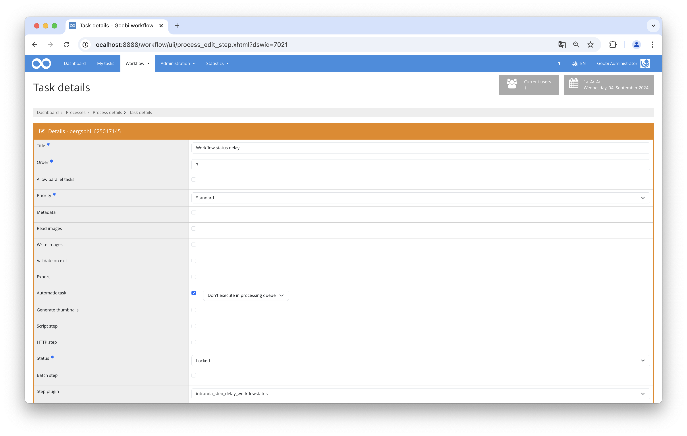

## Introduction  
This documentation explains the installation, configuration, and use of the plugin. This plugin checks if a workflow has reached a specific status. Only if this is the case, a defined work step will be closed, and the next step will be opened.  
  
## Installation  
To use the plugin, the following files must be installed:  
  
```bash  
/opt/digiverso/goobi/plugins/step/plugin_intranda_step_delay_workflowstatus.jar  
/opt/digiverso/goobi/config/plugin_intranda_step_delay_workflowstatus.xml  
```  
  
To use the plugin, it must be selected in a workflow step with the following settings:  
  
| Parameter               | Configuration                                |  
|-------------------------|----------------------------------------------|  
| Automatic Task          | Yes                                          |  
| Plugin for Workflow Step| intranda_step_delay_workflowstatus           |  
| Plugin for Delay        | Yes                                          |  
  
  
  
  
## Overview and Functionality  
When the process reaches the configured step, a check is performed to see if the conditions are met. If this is the case, the step is closed immediately, and the next task can be processed. If not, the task remains in progress. The condition is checked again every night until it is fulfilled.  
  
The condition is only considered met if all configured rules have been fulfilled.  
  
## Configuration  
The plugin is configured in the file `plugin_intranda_step_delay_workflowstatus.xml` as shown here:  
  
{{CONFIG_CONTENT}}  
  
{{CONFIG_DESCRIPTION_PROJECT_STEP}}  
  
The `<condition>` field contains the rules to be checked. Both properties and steps can be checked. The fields within are repeatable to define multiple rules. In this case, all rules must be met for the condition to be considered fulfilled.  
  
In the `<property>` field, the properties to be checked are defined. The `name` attribute specifies the property name, and `value` specifies the value to be checked. The type of check can be defined in `type`. There are four types available:  
  
| Parameter   | Explanation                                                               |  
|-------------|----------------------------------------------------------------------------|  
| `is`        | The status of the step must match the configured status                   |  
| `not`       | The step must not be in the configured status                             |  
| `atleast`   | The step must have at least reached the configured status. This option does not work with `deactivated` or `error`. |
